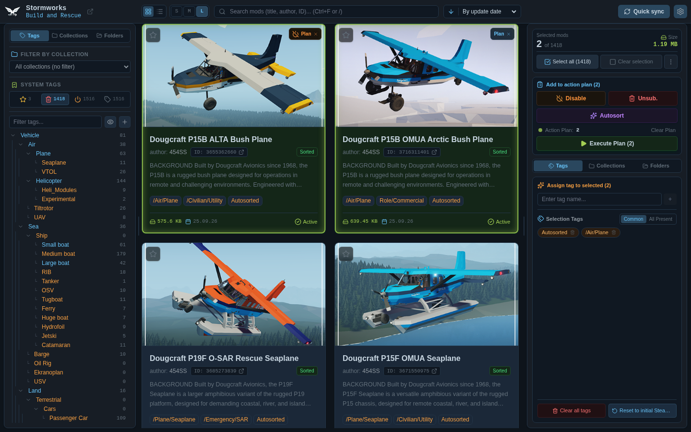
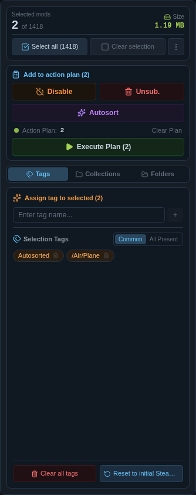
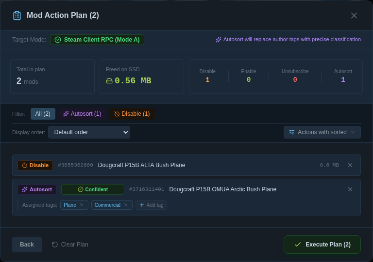
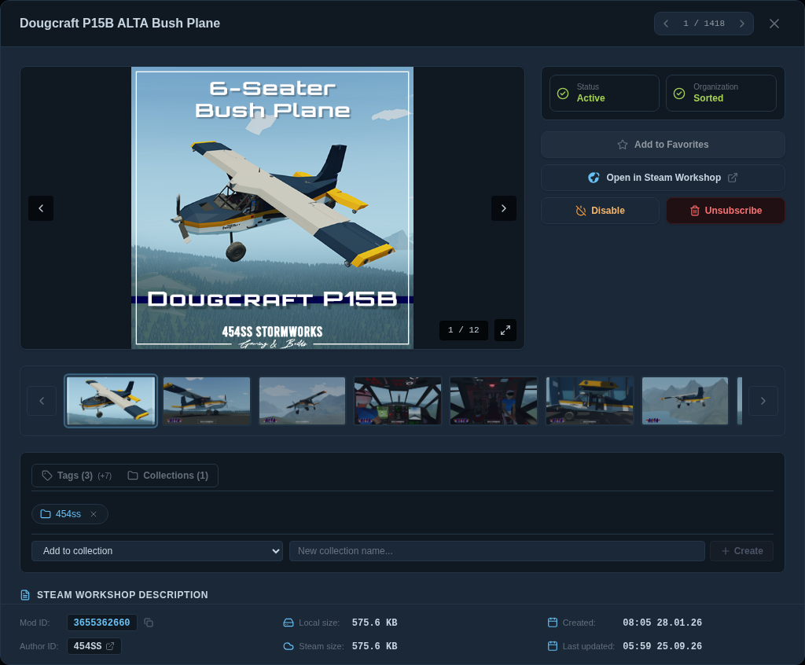
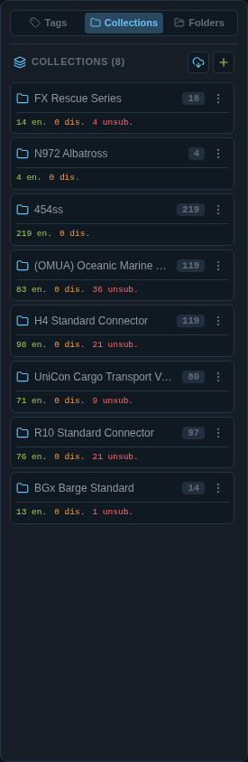
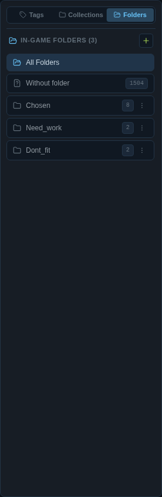
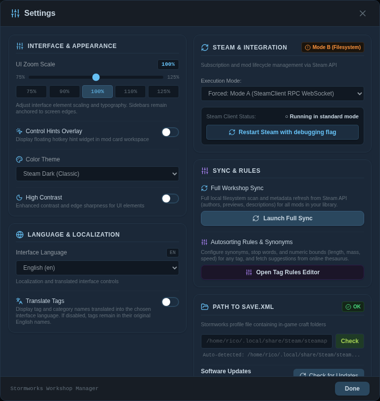

# Stormworks Steam Workshop Manager

[](https://github.com/macenkodenis/stormworks-workshop-manager/releases)
[](https://www.gnu.org/licenses/gpl-3.0)
[](https://python.org)
[](https://react.dev)
[]()

A desktop and web utility for managing subscribed Steam Workshop creations for **Stormworks: Build and Rescue**. Supports offline metadata and image caching, hierarchical tagging with rule-based auto-classification, vehicle folder synchronization, and collection imports.

---

## Screenshots

### Workshop Catalog & Grid


### Tag Management & Batch Operations


### Mod Action Planner & Batch Execution


### Item Details & Gallery Viewer


### Collections & In-Game Vehicle Folders
| Workshop Collections | In-Game Craft Folders (`save.xml`) |
| :---: | :---: |
|  |  |

### Settings & Software Updates


---

## Features

* **Steam Discovery**: Automatically detects Steam installations, library folders, and subscribed items (`app_id: 573090`) across Linux (Native, SteamOS, Flatpak, Snap, Proton) and Windows.
* **Offline Metadata & Cache**: Stores vehicle descriptions, author details, preview thumbnails, and full screenshot galleries in a local SQLite database for offline browsing and filtering.
* **Vehicle Folder Management**: Synchronizes organizational folders directly into in-game vehicle directories (`save.xml`). Includes active game process detection to avoid write conflicts.
* **Hierarchical Tagging & Auto-Classifier**: User-defined tag tree with an automated rule engine that classifies vehicles based on keywords in titles, descriptions, and Workshop tags.
* **In-Place Smart Auto-Updater**: Checks for updates at startup or on demand from Settings. Safely downloads and installs new releases directly over the current installation without overwriting the local database (`stormworks_workshop.db`), user-defined tags, or custom configurations.
* **Full Data Backups & Presets**: Export complete database backups including user tags, collections, and in-game folder snapshots, or share modular tag presets (`.swtags.json`).

---

## Editions & Distribution

The application is distributed in optimized packages for Linux and Windows:

| Edition | Linux Package | Windows Package | Archive Size | Runtime Details |
| :--- | :---: | :---: | :---: | :--- |
| **Slim** (Recommended) | `...-Linux-Slim-x86_64.tar.gz` | `...-Windows-Slim-x64.zip` | ~21–38 MB | Native GPU-accelerated WebView (Edge WebView2 on Windows, WebKit2GTK on Linux). Minimal download size. |
| **Server** | `...-Server-Linux-x86_64.tar.gz` | `...-Server-Windows-x64.zip` | ~18–37 MB | Headless backend only; runs on port `57309` and opens in the system default browser. |
| **Standalone** (Linux only) | `...-Linux-Standalone-x86_64.tar.gz` | — | ~240 MB | Bundled QtWebEngine (Chromium). Completely self-contained for Linux desktop environments. |

### Selection Notes

* **Windows**:
  * **Slim** is the official and recommended edition for Windows 10/11: it utilizes the built-in Microsoft Edge WebView2 runtime (Chromium), providing native look, full GPU acceleration, and responsive UI with an archive size of only ~21 MB.
  * **Server** allows running the service headlessly and accessing the interface in your primary web browser without a separate application window.

* **Linux**:
  * **Standalone** provides full Chromium rendering out of the box, avoiding compositor or scroll latency issues present in WebKitGTK under certain Wayland/Mesa configurations.
  * **Server** runs the backend locally and displays the interface in your existing browser (Chromium/Firefox) with full hardware acceleration.
  * **Slim** requires `webkit2gtk-4.1`. If not installed, it falls back to browser mode automatically.

Binaries are available under [Releases](https://github.com/macenkodenis/stormworks-workshop-manager/releases). For release notes and version history, see [CHANGELOG.md](CHANGELOG.md).

### Automatic Updates

The application checks for new releases on startup (or via **Settings → Check for Updates**). When a new version is detected:
1. An update window displays the changelog and release notes.
2. Clicking **Update Now** downloads the package matching your OS and edition.
3. The update extracts in-place directly over application files without touching your local database (`stormworks_workshop.db`), tag rules, or collections.
4. The application prompts to restart and resumes with all data intact.

---

## Supported Languages

The application interface is fully localized into 28 languages (covering all official Steam Workshop languages):

* English (`en`)
* Українська (`ua`)
* Deutsch (`de`)
* Français (`fr`)
* Italiano (`it`)
* Español (`es`)
* Español (Latinoamérica) (`latam`)
* Polski (`pl`)
* Português (`pt`)
* Português (Brasil) (`pt-br`)
* Čeština (`cs`)
* Dansk (`da`)
* Nederlands (`nl`)
* Suomi (`fi`)
* Ελληνικά (`el`)
* Magyar (`hu`)
* 日本語 (`ja`)
* 한국어 (`ko`)
* Norsk (`no`)
* Română (`ro`)
* 简体中文 (`zh-cn`)
* 繁體中文 (`zh-tw`)
* Svenska (`sv`)
* ไทย (`th`)
* Türkçe (`tr`)
* Български (`bg`)
* Tiếng Việt (`vi`)
* Bahasa Indonesia (`id`)

### Adding or Customizing Translations

Community contributions for additional languages or phrasing improvements are welcome. To add a new language:

1. Copy the reference translation file [`frontend/src/i18n/locales/en.json`](frontend/src/i18n/locales/en.json) to `frontend/src/i18n/locales/<language_code>.json`.
2. Translate the values under `"ui"` (interface labels) and optionally `"tags"` (default category names).
3. Add the language definition to `SUPPORTED_LANGUAGES` in [`frontend/src/i18n/languages.js`](frontend/src/i18n/languages.js):
   ```javascript
   { code: 'your_code', name: 'Native Language Name', steamLang: 'steam_language_identifier' }
   ```
4. Build the frontend (`cd frontend && npm run build`) and test the language selector in the settings menu.

---

## Running from Source

### Prerequisites
* Python 3.10+
* Node.js 18+ and npm

### 1. Clone the repository
```bash
git clone https://github.com/macenkodenis/stormworks-workshop-manager.git
cd stormworks-workshop-manager
```

### 2. Launching
* **Desktop Mode (Native Window)**:
  ```bash
  ./run_desktop.sh
  ```
* **Server Mode (Browser Mode at http://localhost:57309)**:
  ```bash
  ./run_server.sh
  ```
  *(Or with custom parameters: `python run_desktop.py --server --port 57309`)*

---

## Starter Tag Presets

A curated tag pack with vehicle categories (Aircraft, Maritime, Land, Microcontrollers, Missions) is included in [`presets/starter_tags_pack.swtags.json`](presets/starter_tags_pack.swtags.json).

To load it:
1. Open the application.
2. In the sidebar, select **Import Tags**.
3. Choose `presets/starter_tags_pack.swtags.json` and confirm.

---

## Building Binaries

To build binaries locally using PyInstaller:

```bash
# Build frontend first
cd frontend && npm install && npm run build && cd ..

# Then build individual editions:
pyinstaller desktop/desktop.spec        # Standalone
pyinstaller desktop/desktop_slim.spec   # Slim
pyinstaller desktop/server.spec         # Server
```

---

## Contributing

* Bug reports: [Open an issue](https://github.com/macenkodenis/stormworks-workshop-manager/issues/new?template=bug_report.md)
* Feature requests: [Open a request](https://github.com/macenkodenis/stormworks-workshop-manager/issues/new?template=feature_request.md)
* Code contributions: see [CONTRIBUTING.md](CONTRIBUTING.md)

---

## License

This project is licensed under the **GNU General Public License v3.0 (GPLv3)**. See [LICENSE](LICENSE) for details.

The GPLv3 license ensures that this application and derivative works remain open-source and freely accessible to the Stormworks community, preventing closed-source redistribution.

---

Maintained by [SpaceCossaX](https://github.com/SpaceCossaX).
