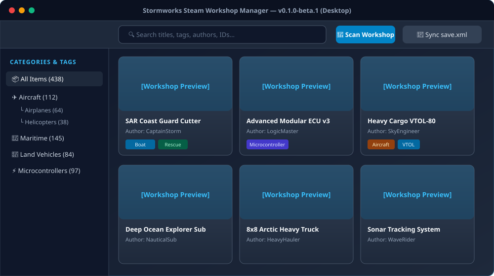
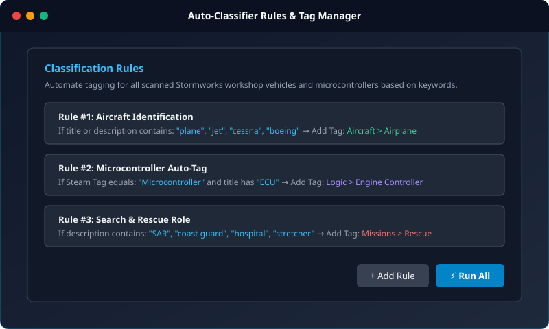

# 🌊 Stormworks Steam Workshop Manager

[](https://github.com/macenkodenis/stormworks-workshop-manager/releases)
[](https://www.gnu.org/licenses/gpl-3.0)
[](https://python.org)
[](https://react.dev)
[]()

A fast, feature-rich desktop and web manager for your subscribed **Stormworks: Build and Rescue** Steam Workshop creations. Seamlessly organize, tag, filter, synchronize with in-game vehicle folders, and browse workshop creations offline with cached high-resolution screenshots and metadata.

---

## 📸 Screenshots

### Main Interface & Workshop Grid


### Auto-Classifier Rules & Tag Hierarchy


---

## ✨ Key Features

* 🚀 **Zero-Configuration Steam Discovery**:
  * Automatically finds your Steam installation and subscribed Stormworks items (`app_id: 573090`).
  * Full support for **Linux (Native, SteamOS, Flatpak, Snap/Proton)** and **Windows**.
* 🖼️ **Offline Metadata & Gallery Cache**:
  * Local SQLite storage for instant sub-millisecond search and browsing.
  * Caches vehicle descriptions, author details, original thumbnail previews, and full screenshot galleries directly from Steam Community.
* 📁 **In-Game Vehicle Folders Sync**:
  * Organize creations into native Stormworks folders directly from the app.
  * Safely edits `save.xml` with active game process detection to avoid file conflicts or save corruption.
* 🏷️ **Hierarchical Tags & Smart Auto-Classifier**:
  * Create custom tags, categories, and nested sub-tags.
  * Define rule-based conditions (keywords in title/description, original Steam tags) to automatically classify hundreds of vehicles in seconds.
* 📦 **Community Presets & Steam Collections**:
  * Import complete Steam Workshop Collections via URL or ID.
  * Export and import modular `.swtags` tag packs. Comes with a ready-to-use [Community Starter Pack](presets/starter_tags_pack.swtags.json).
* 🖥️ **Dual Mode Architecture**:
  * **Desktop Standalone**: Native PyWebView + QtWebEngine desktop application.
  * **Web Application**: Lightweight FastAPI backend with a responsive React 19 + Tailwind CSS frontend accessible from any browser.

---

## 📦 Editions & Downloads

We provide 3 editions tailored to different player needs:

| Edition | Linux | Windows | Size | Best for |
| :--- | :---: | :---: | :---: | :--- |
| **🚀 Standalone** | `...-Linux-Standalone-x86_64.tar.gz` | `...-Windows-Standalone-x64.zip` | ~210–230 MB | **All-in-one.** Bundles dedicated Chromium engine. Guaranteed to work offline on any OS without extra system packages. |
| **🪶 Slim** | `...-Linux-Slim-x86_64.tar.gz` | `...-Windows-Slim-x64.zip` | ~30–45 MB | **Lightweight.** Uses built-in system browser (Edge WebView2 on Windows, WebKitGTK on Linux). Saves storage & RAM. |
| **🌐 Server** | `...-Server-Linux-x86_64.tar.gz` | `...-Server-Windows-x64.zip` | ~15–20 MB | **Ultra-light / Headless.** No GUI dependencies. Runs on port `57309` and automatically opens in your default browser (Chrome, Firefox, etc.). Ideal for home servers and laptops. |

👉 Grab your preferred edition from the **[GitHub Releases](https://github.com/macenkodenis/stormworks-workshop-manager/releases)** page!

---

## ⚡ Quick Start (from Source)

### Prerequisites
* **Python 3.10+**
* **Node.js 18+** & **npm**

### 1. Clone the repository
```bash
git clone https://github.com/macenkodenis/stormworks-workshop-manager.git
cd stormworks-workshop-manager
```

### 2. Running
* **Desktop Mode (Native Window)**:
  ```bash
  ./run_desktop.sh
  ```
* **Server Edition (Browser Mode at http://localhost:57309)**:
  ```bash
  ./run_server.sh
  ```
  *(Or with custom parameters: `python run_desktop.py --server --port 57309`)*

---

## 🏷️ Starter Tag Preset

Want an instantly organized library? We include a curated starter pack with vehicle categories (Aircraft, Maritime, Land, Microcontrollers, Missions):

1. Open the application.
2. In the left sidebar, click **"Імпортувати теги" (Import Tags)**.
3. Select the file: [`presets/starter_tags_pack.swtags.json`](presets/starter_tags_pack.swtags.json).
4. Review the preview and click **Apply**!

---

## 🛠️ Building Standalone Binaries

To build the standalone PyInstaller bundle locally:

```bash
# Build frontend and package desktop bundle
./desktop/build_desktop.sh
```
The compiled application will be located in `dist/StormworksWorkshopManager/`.

---

## 🤝 Contributing & Feedback

Contributions from the Stormworks community are welcome!
* 🐛 Found a bug? Open a [Bug Report](https://github.com/macenkodenis/stormworks-workshop-manager/issues/new?template=bug_report.md).
* 💡 Have an idea? Open a [Feature Request](https://github.com/macenkodenis/stormworks-workshop-manager/issues/new?template=feature_request.md).
* 💻 Want to contribute code? Check out our [Contributing Guidelines](CONTRIBUTING.md) and open a **Pull Request**.

---

## 📜 License

This project is licensed under the **GNU General Public License v3.0 (GPLv3)**.  
See the [LICENSE](LICENSE) file for complete details.

> **Why GPLv3?** This project is dedicated to the Stormworks gaming community. GPLv3 guarantees that this application and all derivative works will forever remain free, open-source, and accessible to everyone, preventing any unauthorized commercialization or closed-source redistribution.

---

**Developed with ❤️ for the Stormworks Community by [SpaceCossaX](https://github.com/SpaceCossaX)**
